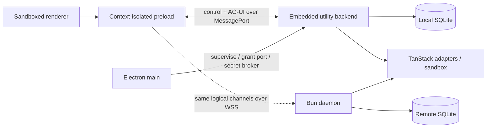

# OpenGBot system architecture proposal

**Status:** Research proposal; [ADR 001](../decisions/001-adopt-tanstack-ai-natively.md) is accepted and binding
**Date:** 2026-08-28
**Scope:** Phase 0 scaffold and evolution seams

## Recommendation

Build one runtime-neutral backend composition with two hosts:

- **Embedded:** Electron main supervises a Node-enabled Electron utility process containing the backend. A private `MessagePort` connects each trusted window; no localhost listener.
- **Remote:** `opengbotd` runs the same backend packages under Bun and exposes a TLS WebSocket plus pairing endpoints.

The desktop remains one installed/user-launched app; “embedded” means bundled, not same-process. The utility process isolates database, provider, and agent failures from Electron main. The daemon is a separate Bun build for another machine.

Use TanStack AI directly as the agent substrate wherever it has a contract: native chat/AG-UI types, `ChatClient`/`useChat`, persistence, resumable streams, locks, memory, tools, interrupts, harness adapters, sandboxes, and agent loops. OpenGBot adds orthogonal backend, project, session, actor, credential, policy, and audit metadata; it must not hide TanStack behind generic OpenGBot adapters or recreate its state machines.

## Phase 0 Bun workspace topology

Scaffold this topology now; all packages are private and use `workspace:*`:

| Workspace                | Responsibility                                                                                                     |
| ------------------------ | ------------------------------------------------------------------------------------------------------------------ |
| `apps/desktop`           | Electron `main`, `preload`, React `renderer`, embedded utility entry, packaging                                    |
| `apps/daemon`            | Bun CLI, TLS/WSS host, pairing, service lifecycle, compiled daemon artifact                                        |
| `packages/contracts`     | OpenGBot backend/project/session/actor/credential/policy/profile schemas and branded IDs only                      |
| `packages/protocol`      | Connection handshake, multiplex frame, and OGP control-operation schemas; imports native AG-UI schemas             |
| `packages/client`        | OGP client and TanStack `SubscribeConnectionAdapter` over MessagePort/WebSocket                                    |
| `packages/backend`       | Authorization, project/session/actor/profile services, native TanStack `chat()` composition and middleware context |
| `packages/persistence`   | Drizzle schema/migrations; native TanStack store implementations; OpenGBot metadata repositories                   |
| `packages/platform`      | Explicit `/electron` and `/bun` exports for SQLite, secrets, filesystem/process, TLS, transport                    |
| `packages/observability` | Redacted structured logs, traces/metrics, diagnostics                                                              |
| `packages/testkit`       | Fake TanStack AI adapter, deterministic IDs/clock, conformance and transport fixtures                              |

Do not scaffold provider-contract, harness-contract, AI-runtime, tool-runtime, or sandbox abstraction packages. Use TanStack types directly. Add `packages/integrations/<name>` only for documented integration setup that cannot live cleanly in `backend` or `platform`; it should still implement/export native TanStack types.

Pin Bun, Electron, TanStack AI packages, database drivers, TypeScript, Drizzle, Zod, oxlint, oxfmt, and packaging tools through a root catalog and committed `bun.lock`. Use strict TypeScript, package `exports`, and restricted imports. Renderer gets DOM but no Node types. Pure tests run under Bun; embedded integration tests run under the exact Electron runtime.

## Electron boundaries

**Main** owns application/window lifecycle, a private `app://` scheme, restrictive CSP/navigation/permission handlers, utility supervision, native dialogs, signed updates, client-port grants, and the embedded OS secret broker. It owns no projects, sessions, chat runs, provider calls, or database queries.

**Preload** receives one main-granted port and exposes a frozen `window.opengbot`: connection status, typed control requests, a TanStack chat connection, subscriptions, and narrowly vetted desktop actions. It validates frames and never exposes raw `ipcRenderer`, Electron events, arbitrary channels, filesystem, shell, or secret-store APIs.

**Renderer** is sandboxed with `nodeIntegration: false` and `contextIsolation: true`. It uses shadcn/React plus `@tanstack/ai-react`; it stores no provider secrets, auth tokens, or authoritative transcripts. Markdown/HTML and external links are untrusted.

**Utility backend** owns persistence and agent execution but is not a hostile-code sandbox. Harnesses and tool workloads run through TanStack sandbox providers in further processes/containers.

Main validates frame/origin before granting a port. The backend derives principal/project/actor context server-side and ignores identity claims in renderer-controlled `forwardedProps`.

## Transport and protocol decision

Use one physical connection with three discriminated frame channels:

- `connection`: hello, feature/version negotiation, heartbeat, auth expiry;
- `control`: OpenGBot Protocol (OGP) request/response and small entity notifications;
- `chat`: native TanStack/AG-UI `RunAgentInput`, `StreamChunk`, resume-offset, and abort frames.

Local uses a private `MessagePort`; remote uses `wss://` with subprotocol `opengbot.v1`. Both pass the same JSON codec and runtime schemas. Local mode has no bearer token or TCP listener: the main-granted port is the capability. Remote authenticates during WebSocket upgrade with a short-lived opaque access credential, never a URL token.

The renderer's chat channel implements TanStack's subscribe/send `ConnectionAdapter`, so `ChatClient`/`useChat` natively own stream processing, tool parts, interrupts, and UI message assembly in both modes. OpenGBot does not translate AG-UI into a second event vocabulary.

OGP is limited to `backend.*`, `project.*`, `session.*`, `actor.*`, `profile.*`, `credential.*`, `policy.*`, and diagnostics metadata. Mutations carry a `commandId`; the backend stores bounded idempotency receipts. Chat start/stop/resume uses TanStack client methods, thread/run IDs, and frames, not OGP RPCs.

Handshake returns protocol range, TanStack/AG-UI feature set, backend instance ID, deployment mode, server version, schema generation, principal scopes, and limits. Major mismatch fails closed; additive behavior uses named features. A slow remote consumer is disconnected with a resumable reason rather than consuming unbounded memory.

## TanStack-first composition

For every chat, `packages/backend` resolves authorized server context containing `backendId`, `projectId`, `sessionId`, `actorId`, `principalId`, credential/profile choice, and effective policy. It then uses native TanStack composition:

1. OpenGBot authorization/policy/budget and audit middleware;
2. TanStack `withLocks` and server-authoritative `withPersistence`;
3. SQLite `StreamDurability` for append-before-delivery/resume;
4. `memoryMiddleware` only when project policy enables cross-turn/session memory;
5. `withSandbox` for coding-harness actors;
6. an official TanStack provider/harness adapter or documented TanStack `AIAdapter` implementation;
7. `chat()` with native tools, interrupts, bounded agent-loop/tool-call policy, and `AbortController`.

OpenGBot plugins should export TanStack tools, middleware, adapters, or sandbox providers plus OpenGBot manifest/policy metadata. A plugin interface must not wrap those types merely as churn insurance.

## Project, session, actor, and multi-agent model

- **Backend** is a stable data/compute universe. Switching backend does not sync data implicitly.
- **Project** is the strongest isolation boundary and owns backend-local roots, credential/profile availability, memory scope, and policy.
- **Session** is the user-visible bot workspace.
- **Actor** is one participant in a session and maps one-to-one to a durable TanStack `threadId`.
- **Run** is TanStack's fresh `runId` for one actor turn; nested work uses `parentRunId`.

A root actor and child/subagent actors use the same model. `actor_edges` records parent actor, spawning run/tool call, purpose, lifecycle, and inherited/reduced budget. A TanStack server tool can create a child actor/thread, invoke `chat()` with `parentRunId`, and return its typed result to the parent. Each actor retains its native TanStack transcript. Enforce maximum depth, fan-out, concurrency, time/token/cost, and cancellation propagation through OpenGBot policy middleware; do not invent a separate multi-agent stream format.

Project roots are resources on the backend machine. Native directory selection is embedded-only; remote roots must be below daemon-admin allowlists. Every metadata lookup and TanStack `Scope` is derived from authorized backend/project/session/actor identity, never a client-supplied thread ID alone.

## Persistence

Use one owner-only SQLite database per backend on a local filesystem, with WAL, foreign keys, busy timeout, checks, and one backend-process data-directory lock. Never put a live WAL database on NFS/SMB/cloud-sync storage.

`packages/persistence` implements native TanStack contracts and runs their conformance suites for:

- messages, runs, interrupts, and metadata via `@tanstack/ai-persistence`;
- per-run ordered logs via `StreamDurability` (`append` commits before delivery; opaque offsets; `close` terminalizes);
- locks/fencing for duplicate/takeover prevention;
- memory via `@tanstack/ai-memory`, scoped by project/actor policy;
- artifacts/blobs and sandbox snapshots when those features land.

OpenGBot tables are `backend_meta`, `projects`, `project_roots`, `sessions`, `actors`, `actor_edges`, `profiles`, `credentials`, `policy_bindings`, `command_receipts`, `remote_devices`, and `auth_sessions`. TanStack store rows are authoritative for messages, runs, interrupts, stream chunks, memory, and artifacts; do not duplicate them into custom OpenGBot state models. Audit rows may reference TanStack IDs without becoming a second state machine.

Use Drizzle for typed schema/query construction and reviewed forward-only SQL migrations. Bun host uses `bun:sqlite`. Electron uses the pinned runtime's `node:sqlite` only if release tests cover required backup/defensive APIs; otherwise package `better-sqlite3` for the exact Electron ABI. Cross-driver tests are mandatory. Backup through a driver backup/checkpoint API, never by copying only the live main file.

## Codex, Grok, credentials, and secrets

Profiles reference a credential record whose kind is `host_cli_login`, `api_key`, `oauth_device`, or `none`; kind is never inferred from provider name.

Phase 0 priority is **Codex then Grok** through native TanStack harness adapters where they meet audited behavior:

- Codex uses host-owned login/device auth. Prefer `@tanstack/ai-codex` with host auth; if documented Codex app-server integration needs a thin implementation, it implements TanStack `AIAdapter` directly. Codex app-server/CLI owns device auth. OpenGBot stores status/profile metadata only and never reads, copies, refreshes, or keychains its tokens.
- Grok uses `@tanstack/ai-grok-build`. Enable `host_cli_login` only if the current T3 Code/Hermes/TanStack harness audit confirms a documented supported login. Otherwise require an OpenGBot-owned API key or defer it; never label an undocumented/session-token flow as OAuth.
- On a remote backend, host login means login on the daemon machine, not the desktop. UI always shows credential kind, owner, and location.

Only OpenGBot-owned API keys or OAuth refresh tokens use opaque `secretRef`s. Embedded secrets are brokered by Electron main through asynchronous `safeStorage`; detect weak Linux fallback rather than claiming protection. Remote secrets use an OS keyring or authenticated-encrypted owner-only vault unlocked by service credential/interactive input; no plaintext fallback. Plaintext never enters SQLite, logs, diagnostics, renderer persistence, or plugin metadata.

Remote pairing uses TLS, a single-use high-entropy token and certificate fingerprint, then rotating opaque device credentials. Desktop stores the refresh credential in OS-backed storage; daemon stores hashes and supports revocation. Bind loopback by default; non-loopback requires explicit TLS. No relay or multi-tenancy in Phase 0.

## Tools, approvals, sandboxing, and cancellation

Define tools with native TanStack `toolDefinition()` and server implementations. Use `needsApproval` and AG-UI interrupts; persist them through the TanStack interrupts store with atomic batch commit. OpenGBot middleware attaches orthogonal project/actor/policy/risk/input-digest audit metadata and may emit typed generic interrupts. One-shot approval is default. Approval authorizes an exact action; it is not containment.

Use native `@tanstack/ai-sandbox` definitions, workspaces, policies, lifecycle, snapshots, and providers. `localProcessSandbox` is process isolation, not a security sandbox; label it accordingly. Docker/microVM providers are optional stronger boundaries. OpenGBot fails closed when project policy requires a guarantee the selected harness/provider cannot express; upstream degradation warnings are insufficient for mandatory denies. Default filesystem/network access is deny, project-root access is explicit, and secrets are narrowly leased.

Cancellation flows from TanStack client abort → chat-channel abort frame → backend `AbortController` → adapter/sandbox. UI shows “cancellation requested” until terminal output. Late content is discarded; usage may still be recorded. Retry creates a new `runId`. On restart, TanStack persistence restores transcripts and pending interrupts; uncertain non-idempotent side effects are never automatically replayed.

## Migrations, observability, offline, and updates

Migrations are numbered, checksummed, forward-only, backed up before application, and verified before readiness. Downgrade after schema change is unsupported except explicit backup restore. Protocol, database schema, TanStack store schema, and app versions are independent compatibility dimensions.

Emit redacted structured logs and OpenTelemetry-compatible signals keyed by trace/backend/project/session/actor/thread/run IDs. Record boot/migration, connection, auth, queue/first-token, adapter, interrupt, sandbox, cancellation, SQLite/WAL, and durability metrics. Content, reasoning, tool bodies, paths, headers, environment, and secrets are excluded by default. Diagnostic bundles are previewable and content opt-in.

Embedded history remains browseable offline; provider calls fail explicitly. Remote stale state is read-only in memory in Phase 0. Do not queue chats, approvals, or tool actions for surprise execution on reconnect. Desktop updates ship embedded backend in lockstep and drain/checkpoint before replacement; daemon updates remain administrator-controlled. Compatibility is negotiated before state access.

## Phase 0 vertical slice

1. Scaffold the workspace above with strict import boundaries and pinned TanStack packages.
2. Start the embedded utility, grant a private port, complete handshake, and open/migrate SQLite.
3. Implement the multiplexer, OGP control client, and one native TanStack subscribe/send connection adapter used by MessagePort and WSS.
4. Implement TanStack messages/runs/interrupts, locks, and SQLite `StreamDurability`; prove them with upstream conformance tests and a fake adapter.
5. Create/select a project, session, and root actor; always show backend, project, actor, harness/provider, credential kind/location, and model.
6. Integrate Codex host login first; integrate Grok only through documented host login or an OpenGBot-owned API key.
7. Stream through `useChat`, stop, retry with a new run, disconnect/resume without a second provider call, and reopen without losing transcript.
8. Exercise the Bun daemon over TLS with pairing and the same backend/persistence/AG-UI path; a minimal remote profile is sufficient.
9. Test duplicate commands/run IDs, revoked auth, certificate mismatch, slow consumers, utility crash, interrupted run, pending interrupt recovery, and secret redaction.

Side-effecting tools, polished approvals, child-actor UI, filesystem context, external plugin loading, artifact sync, public relay, and multi-tenancy are deferred. Their native TanStack/OpenGBot metadata seams are established now.

## Tradeoffs and rejected options

| Choice                                   | Rejected alternative                                                                       |
| ---------------------------------------- | ------------------------------------------------------------------------------------------ |
| Utility-process embedded backend         | Main-process backend risks desktop lifecycle; renderer backend violates privilege boundary |
| Private MessagePort locally              | Localhost HTTP adds listener/auth surface                                                  |
| One multiplex schema across transports   | Ad hoc Electron IPC creates a second product API                                           |
| OGP control + native AG-UI chat          | Re-modeling TanStack chunks/messages/interrupts causes drift and loses client tooling      |
| Native TanStack persistence/durability   | Custom transcript/event/approval state duplicates upstream state machines                  |
| Modular monolith + SQLite                | Microservices/Postgres burden embedded operation without a scale need                      |
| Native harness/sandbox contracts         | Generic OpenGBot wrappers obscure capabilities and add churn rather than insulating it     |
| Host login as a distinct credential kind | Copying CLI tokens creates unsupported account/security risk                               |
| Direct TLS daemon                        | Relay/rendezvous creates an out-of-scope cloud trust boundary                              |
| No offline mutation queue                | Deferred chats/approvals can trigger costly or dangerous surprise work                     |

## ADR status and candidates

Accepted: **ADR 001 adopts native TanStack AI contracts without generic wrappers.**

Candidates:

1. Electron utility host and Bun daemon over one backend composition.
2. MessagePort/WSS multiplexer with OGP control and native TanStack AG-UI chat.
3. Secure Electron main/preload/renderer boundary and private `app://` scheme.
4. SQLite/Drizzle with runtime-specific drivers and TanStack conformance tests.
5. Backend/project/session/actor/policy metadata; actor maps to TanStack thread.
6. Codex/Grok priority and explicit `host_cli_login` ownership.
7. Opaque OpenGBot secret references and separate embedded/daemon secret stores.
8. TLS pairing with rotating opaque remote-device credentials.
9. Forward-only migrations, feature negotiation, redacted observability, and no offline mutation queue.

## Primary references

- [Initial product brief](../briefs/000-initial-product-brief.md)
- Electron: [security](https://www.electronjs.org/docs/latest/tutorial/security), [`utilityProcess`](https://www.electronjs.org/docs/latest/api/utility-process), [`safeStorage`](https://www.electronjs.org/docs/latest/api/safe-storage)
- TanStack AI: [connection adapters](https://tanstack.com/ai/latest/docs/chat/connection-adapters), [persistence](https://tanstack.com/ai/latest/docs/persistence/overview), [resumable streams](https://tanstack.com/ai/latest/docs/resumable-streams/overview), [interrupts](https://tanstack.com/ai/latest/docs/interrupts/overview), [sandboxes](https://tanstack.com/ai/latest/docs/sandbox/overview), [harnesses](https://tanstack.com/ai/latest/docs/sandbox/harnesses), [memory](https://tanstack.com/ai/latest/docs/memory/overview)
- Bun: [workspaces](https://bun.sh/docs/pm/workspaces), [SQLite](https://bun.sh/docs/runtime/sqlite), [WebSockets](https://bun.sh/docs/runtime/http/websockets)
- SQLite: [WAL](https://www.sqlite.org/wal.html)
