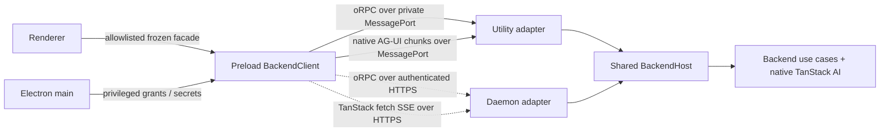

# Current architecture audit and next production slices

**Status:** Audit and implementation proposal; ADRs remain authoritative
**Date:** 2026-08-29
**Baseline:** `8ab09f5`

## Verdict

The user's concern is valid. The first slice works and its security boundary is
sound, but process entries currently own application, transport, and lifecycle
logic that the daemon cannot reuse. This is now a material scaling blocker:

| Evidence                                                                                                                                       | Architectural effect                                                |
| ---------------------------------------------------------------------------------------------------------------------------------------------- | ------------------------------------------------------------------- |
| `desktop/src/main.ts` (333 lines) owns windows, menus, utility supervision, a hand-written privileged RPC client, project grants, and shutdown | Electron main is coupled to backend protocol mechanics              |
| `desktop/src/preload.ts` (247 lines) owns connection state, RPC correlation, stream sequencing, cancellation, and bridge exposure              | One file is both transport client and security facade               |
| `desktop/src/utility.ts` (242 lines) owns composition, authorization, RPC dispatch, run registry, stream framing, and drain                    | The actual backend host exists only inside the desktop app          |
| `renderer/app.tsx` (868 lines) owns boot/project state, shell, chat, persistence, commands, and rendering                                      | Product features cannot evolve independently                        |
| `daemon/src/app.ts` exposes only health and handshake                                                                                          | `features.remote: true` is capability intent, not current readiness |
| `protocol/src/index.ts` combines domain schemas, custom RPC, and chat transport envelopes                                                      | Control evolution and TanStack streaming are unnecessarily coupled  |

This is expected first-slice debt, not a reason to replace TanStack AI or the
utility-process boundary. Preserve the working behavior while moving it behind
one reusable backend host.

## Target package and module topology

Keep the topology small enough to scaffold immediately:

| Location                              | Owns                                                                                                                           | Must not own                                                             |
| ------------------------------------- | ------------------------------------------------------------------------------------------------------------------------------ | ------------------------------------------------------------------------ |
| `packages/protocol`                   | Browser-safe Zod domain schemas, oRPC control contracts, stable public error data, protocol compatibility                      | Electron, Hono, storage, provider execution, an alternate AI event model |
| `packages/backend`                    | Project/provider/account/profile use cases, authorization and policy, native TanStack `chat()` composition, Codex/Grok modules | MessagePort, HTTP, Electron, process signals                             |
| `packages/backend-host` (new)         | `BackendHost`, oRPC router/context, run registry, chat request handler, start/drain/close and health                           | Window/UI behavior, transport credentials, provider-token storage        |
| `packages/observability` (new, small) | Structured logger contract, redaction, correlation context, TanStack logger adapter                                            | User content collection by default                                       |
| `packages/persistence` (later)        | Repositories, SQL migrations, native TanStack persistence/durability stores                                                    | Domain policy or transport                                               |
| `apps/desktop`                        | Electron composition and MessagePort adapters; React product                                                                   | Backend use cases                                                        |
| `apps/daemon`                         | Bun/Hono composition, remote auth/TLS, HTTP adapters, signals                                                                  | A second backend implementation                                          |

Do not add an OpenGBot AI/provider abstraction. Codex and Grok modules should
instantiate and configure their native TanStack adapters directly. OpenGBot
types add backend, project, provider-account, actor, credential-owner, and
policy metadata only.

Recommended source split:

```text
packages/protocol/src/{domain,control-contract,errors,chat-context}.ts
packages/backend/src/{projects,accounts,providers,selections,chat}/...
packages/backend-host/src/{host,control-router,chat-handler,run-registry,context}.ts
apps/desktop/src/main/{index,window,menu,backend-supervisor,project-grants,secrets}.ts
apps/desktop/src/preload/{index,backend-client,embedded-control,embedded-chat,bridge}.ts
apps/desktop/src/renderer/{app,features/backend,features/projects,features/providers,features/chat,components/shell}/...
apps/daemon/src/{main,app,auth,config}.ts
```

Entries (`main/index`, preload `index`, utility entry, daemon `main`) should be
composition roots, normally under roughly 100 lines, not global dumping grounds.
Line count is a signal rather than a hard test; dependency direction is the
enforced rule.

## Shared host and transport decision

Use two logical planes over deployment-appropriate transports:



### Control plane: oRPC v2

oRPC is justified for bounded request/response control operations. Its official
adapters cover MessagePort/Electron and Fetch/Hono, and its contracts support
runtime schemas, typed errors, context, and middleware. This replaces the
hand-written request maps and `request_failed` catch-all without inventing two
APIs.

- Put contracts in `packages/protocol`; put the router in `backend-host`.
- Embedded utility attaches `@orpc/server/message-port` `RPCHandler`; preload
  uses `@orpc/client/message-port` `RPCLink`.
- Daemon mounts the same router through the Fetch/Hono handler under `/rpc/*`.
- Create separate public and host/admin procedure sets. A renderer connection
  cannot submit an arbitrary filesystem path. Electron main grants a selected
  path through a host-capability context.
- Do not expose a raw oRPC client, `MessagePort`, or `ipcRenderer` to the page.
  Preload exposes individual, allowlisted methods with serializable results.
- Do not use oRPC experimental transfer/streaming features for chat.

Initial public procedures should be `system.handshake`, `provider.list`,
`account.list`, `account.probe`, `selection.get`, `selection.set`, and project
queries. `project.grantLocalRoot` is host-only. Remote root administration is a
daemon-local admin operation, not the desktop directory picker.

### AI plane: native TanStack AG-UI

Keep chat native to TanStack AI per ADR 001:

- `BackendHost.runChat` validates native `RunAgentInput`, resolves authorized
  OpenGBot context, calls `chat()`, and yields native `StreamChunk` values.
- Embedded mode retains a small MessagePort `ConnectionAdapter`; framing,
  sequence, disconnect, and cancellation code moves out of `utility.ts` and
  `preload.ts` into transport modules.
- Remote mode uses authenticated `POST /v1/chat` with
  `chatParamsFromRequestBody`, `toServerSentEventsResponse`, and
  `fetchServerSentEvents`. Abort the fetch to cancel; the signal reaches the
  shared run registry, adapter, and sandbox.
- Remote credentials remain in Electron main/preload trusted code. The renderer
  receives status and native chunks, never bearer/API credentials.

WebSocket is not justified for the current one-request/one-stream chat. HTTPS
SSE already supplies streaming, cancellation, proxy compatibility, and native
TanStack helpers. Reconsider a native TanStack subscribe adapter only when the
product needs idle server push, presence, or multiplexed live subagent events.

## Electron responsibility boundary

- **Main:** app/window/menu/update lifecycle, utility supervision, native project
  grants, OS secret broker, and remote-backend credential broker only.
- **Preload:** owns the mode-neutral `BackendClient`, validates the bridge edge,
  maintains transport connection state, and exposes a frozen allowlist.
- **Renderer:** owns React state and views. Split shell, boot/backend selection,
  project, provider/account selection, chat, and message rendering into feature
  modules. It imports no Electron, Node, backend-host, or secrets code.
- **Utility entry:** reads configuration, builds the shared `BackendHost`, attaches
  MessagePorts with server-derived roles, and forwards lifecycle signals.

The current connection-owned cancellation and graceful drain behavior must move
intact; decomposition must not reopen those fixed races.

## Immediate provider/account slice

Use one backend application home on every machine:

```text
~/.opengbot/                         # or explicit OPENGBOT_HOME
  state/registry.v1.json             # initial atomic metadata store
  logs/                              # redacted desktop/backend logs
  cache/                             # disposable provider/model probes
  run/                               # owner lock and ephemeral runtime files
```

The directory is owner-only and single-writer locked. Embedded and daemon modes
resolve the same layout on their respective backend machine. Electron `userData`
may continue to hold disposable window preferences, but backend/project/account
metadata moves to `OPENGBOT_HOME`. Secrets never live there. Start with a
runtime-validated, versioned, atomic JSON registry so the next slice does not
also require cross-runtime SQLite drivers; migrate it once into the later SQL
store with backup and checksum.

Concrete metadata:

```ts
type CredentialKind = "host_cli_login" | "api_key" | "browser_oauth";
type CredentialOwner = "provider_cli" | "opengbot_keychain";

interface ProviderAccountSummary {
  id: string;
  backendId: string;
  providerId: "codex" | "grok";
  credentialKind: CredentialKind;
  credentialOwner: CredentialOwner;
  label: string;
  status: "ready" | "login_required" | "missing_cli" | "unavailable";
  executableVersion: string | null;
  lastCheckedAt: string | null;
}

interface ModelSelection {
  projectId: string;
  accountId: string;
  modelId: string;
}
```

Provider catalogs are code/versioned capabilities; accounts and selections are
backend-local persisted records. Never persist model autocomplete as an account
entitlement guarantee.

Credential matrix for the first providers:

| Mode                                   | Codex                                                                                  | Grok Build                                                                  | Owner/storage                                                                                                             |
| -------------------------------------- | -------------------------------------------------------------------------------------- | --------------------------------------------------------------------------- | ------------------------------------------------------------------------------------------------------------------------- |
| Host CLI login                         | Supported by pinned TanStack adapters with `authMode: "host"`; user runs `codex login` | Supported by pinned adapter with `authMode: "host"`; user runs `grok login` | Official CLI owns its OAuth/cache on the backend host; OpenGBot stores status only                                        |
| API key                                | `CODEX_API_KEY` mode                                                                   | `XAI_API_KEY` / ACP `xai.api_key` mode                                      | OpenGBot stores an opaque `secretRef`; secret is in OS keychain/secret service and is leased only to the provider process |
| Browser/device OAuth owned by OpenGBot | Not supported for Phase 0                                                              | Not supported for Phase 0                                                   | Add only for a documented third-party flow; backend owns PKCE/device exchange and keychain refresh token                  |

CLI login may open a browser, but that remains `host_cli_login`; it is not
OpenGBot browser OAuth. Never read or copy `~/.codex/auth.json`, Grok cached
tokens, browser cookies, or another harness's credential files. Initially add
API keys through a backend-local credential command/secret broker, not the
ordinary control contract. On a remote backend, both CLI login and key storage
happen on the daemon machine.

The first UI addition lists Codex and Grok accounts, status, credential kind,
backend location, selectable model, and active project/account/model. It should
not claim remote availability until the daemon serves the same control and chat
parity suite with authentication/TLS.

## Errors, logging, lifecycle, and observability

Define stable public error codes in the oRPC contract, including
`PROTOCOL_INCOMPATIBLE`, `BACKEND_UNAVAILABLE`, `PROJECT_GRANT_REQUIRED`,
`ACCOUNT_NOT_FOUND`, `ACCOUNT_LOGIN_REQUIRED`, `MODEL_UNSUPPORTED`, `FORBIDDEN`,
`RUN_CONFLICT`, and `INVALID_INPUT`. Public data contains only safe IDs,
`retryable`, and a remediation action. Internal causes, paths, CLI output,
headers, and stacks are logged, not serialized. After an SSE stream starts,
fail with a native AG-UI run error containing safe metadata.

`BackendHost` has explicit `start()`, `attachControl()`, `runChat()`, `drain()`,
and `close()` operations plus liveness/readiness. Both hosts reject new work
while draining and await active run promises within a bounded deadline. Desktop
`BackendSupervisor` uses `stopped → starting → ready → draining/crashed` states;
daemon signal handlers use the same drain path. Daemon exposes `/health/live`
and `/health/ready`; readiness requires home lock, registry migration, and
provider catalog initialization, not a successful provider login.

Emit newline-delimited structured logs with `timestamp`, `level`, `event`,
`component`, `deployment`, `backendId`, `requestId`, `projectId`, `accountId`,
`threadId`, `runId`, `procedure`, `durationMs`, and safe `errorCode`. Add one
redacting logger adapter for TanStack debug hooks. Message/reasoning/tool bodies,
secrets, environment, headers, and full project paths are excluded by default.
Utility stdout remains structured and main forwards it without rewriting;
daemon logs to stdout for service collection.

## Incremental migration and gates

1. **Home + accounts (next):** add app-home resolution, versioned atomic registry,
   Codex/Grok account probes, provider/account/model contracts, persisted
   selection, and focused UI. Keep the working transport and chat path.
2. **Mechanical decomposition:** split main/preload/renderer/utility by the
   modules above without behavior changes. Preserve current lifecycle tests.
3. **oRPC control:** introduce contracts/router, migrate handshake/account/project
   control, and delete the hand-written pending-control maps. Keep chat unchanged.
4. **Shared host:** move run registry, authorization, chat handler, and drain into
   `backend-host`; utility becomes an adapter. Make daemon use the same factory.
5. **Remote parity:** add authenticated HTTPS oRPC + SSE, remote BackendClient,
   TLS/pairing, and mark remote ready only after conformance passes.
6. **Durable state:** migrate registry/project metadata and native TanStack
   persistence/durability to reviewed forward-only SQL migrations.

Required tests:

- provider account schema/migration, deterministic host accounts, CLI missing/
  logged-out/ready probes, keychain references, and model-selection authorization;
- identical oRPC contract cases through MessagePort and Fetch/Hono handlers;
- native chunk order, cancellation, disconnect, duplicate run, and stream error
  parity through embedded and remote adapters;
- public versus host/admin capability denial, including arbitrary project paths;
- utility/daemon startup, crash, drain timeout, process lock, liveness/readiness;
- log/error snapshots proving secret, env, content, and path redaction;
- renderer bridge tests proving no raw IPC/port/token exposure;
- Electron smoke for project → account/model selection → Codex chat.

## Tradeoffs and rejected options

| Decision                                                       | Rejected option                                                                    |
| -------------------------------------------------------------- | ---------------------------------------------------------------------------------- |
| Shared backend host with thin app adapters                     | Keeping utility as the only real backend and separately rebuilding daemon behavior |
| oRPC for control only                                          | More hand-written correlation/error dispatch or wrapping AG-UI in RPC              |
| MessagePort embedded, HTTPS SSE remote                         | Localhost listener in embedded mode or premature WebSocket multiplexing            |
| Preload mode-neutral client                                    | Renderer-owned remote credential or unrestricted backend client                    |
| Versioned JSON for the immediate registry, SQL migration later | Blocking account selection on cross-runtime database/ABI work                      |
| CLI-owned host login distinct from API key                     | Copying OAuth grants or presenting API billing as a subscription login             |

## Primary references

- [ADR 001](../decisions/001-adopt-tanstack-ai-natively.md), [ADR 002](../decisions/002-embedded-utility-and-remote-daemon.md), [ADR 003](../decisions/003-provider-owned-cli-auth.md), [ADR 004](../decisions/004-project-scoped-codex-slice.md)
- oRPC: [Electron adapter](https://orpc.dev/docs/adapters/electron), [MessagePort adapter](https://orpc.dev/docs/adapters/message-port), [Hono adapter](https://orpc.dev/docs/adapters/hono), [typed errors](https://orpc.dev/docs/error-handling)
- TanStack AI: [custom backend integration](https://tanstack.com/ai/latest/docs/chat/custom-backend), [AG-UI](https://tanstack.com/ai/latest/docs/protocols/ag-ui), [debug logging](https://tanstack.com/ai/latest/docs/guides/debugging)
- [Codex/Grok auth audit](003-codex-grok-auth-patterns.md)
